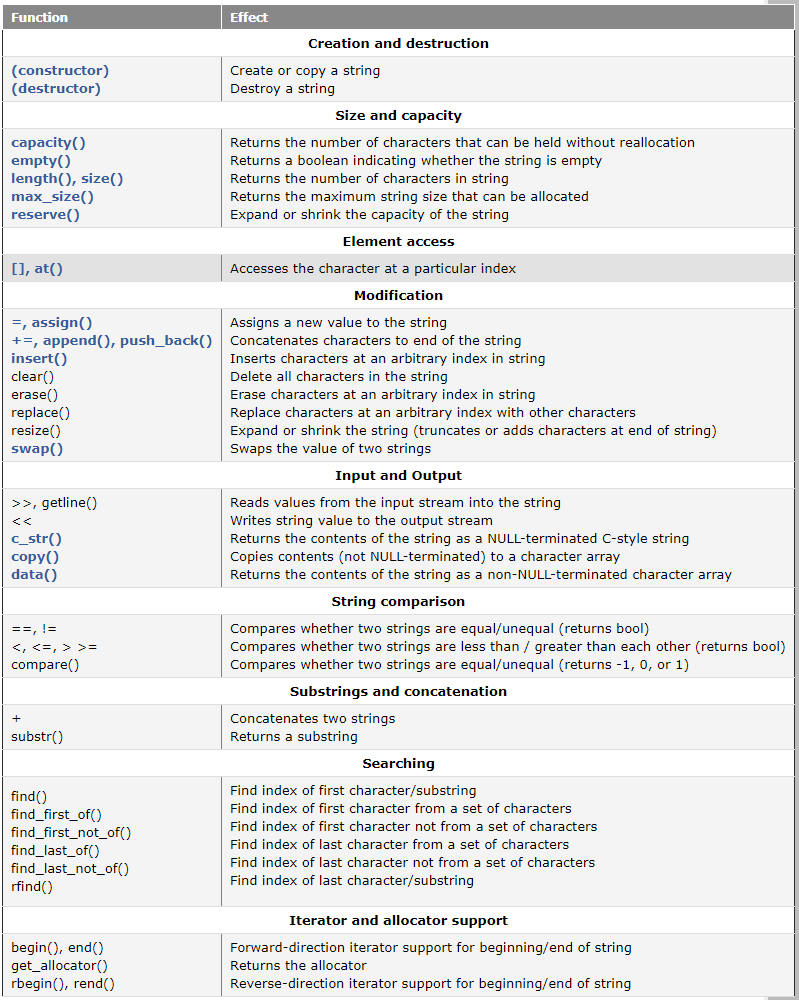

# Fundamental Data Types

## char
- '9' - '0'的类型为**int**
## Now that fixed-width integers have been added to C++, the best practice for integers in C++ is as follows:
- int should be preferred when the size of the integer doesn’t matter (e.g. the number will always fit within the range of a 2 byte signed integer). For example, if you're asking the user to enter their age, or counting from 1 to 10, it doesn’t matter whether int is 16 or 32 bits (the numbers will fit either way). This will cover the vast majority of the cases you’re likely to run across.
- If you need a variable guaranteed to be a particular size and want to favor performance, use std::int_fast#_t.
- If you need a variable guaranteed to be a particular size and want to favor memory conservation over performance, use std::int_least#_t. This is used most often when allocating lots of variables.
------------------
## Floating point number
- Favor double over float unless space is at a premium, as the lack of precision in a float will often lead to inaccuracies.
## const
- Any variable that should not be modifiable after initialization and whose initializer is known at compile-time should be declared as constexpr.
- Any variable that should not be modifiable after initialization and whose initializer is not known at compile-time should be declared as const.


# Debug
```
//Using g++, you can use the -I option to specify an alternate include directory.
//g++ -o main -I/source/includes main.cpp
```
- When using print statements, use `std::cerr` instead of `std::cout`.
- C++ cout利用控制符dec、hex和oct，分别输出十进制、十六进制和八进制显示整数

## literals

| Data Type | Suffix                                    | Meaning            |
| --------- | ----------------------------------------- | ------------------ |
| int       | u or U                                    | unsigned int       |
| int       | l or L                                    | long               |
| int       | ul, uL, Ul, UL, lu, lU, Lu, or LU         | unsigned long      |
| int       | ll or LL                                  | long long          |
| int       | ull, uLL, Ull, ULL, llu, llU, LLu, or LLU | unsigned long long |
| double    | f or F                                    | float              |
| double    | l or L                                    | long double        |

# Operators
- [Table of operators](https://www.learncpp.com/cpp-tutorial/operator-precedence-and-associativity/)
- [scope-duration-and-linkage-summary](https://www.learncpp.com/cpp-tutorial/scope-duration-and-linkage-summary/)
- The modulus operator can also work with negative operands. x % y always returns results with the sign of x.
- Avoid the postfix versions of these operators whenever possible.
- `double x{ 0.1 + 0.1 + 0.1 }; return (x == 0.3);` return false;
- De Morgan’s law says that if we distribute a NOT, we need to flip ORs and ANDs to the other. So ~(option4 | option5) becomes ~option4 & ~option5.
-  In C++, the term inline has evolved to mean “multiple definitions are allowed”.
- When applied to a global variable, the static keyword defines the global variable as having internal linkage, meaning the variable cannot be exported to other files.
- When applied to a local variable, the static keyword defines the local variable as having static duration, meaning the variable will only be created once, and will not be destroyed until the end of the program.
- int8_t is actually a type alias for signed char
- Don’t assign the same value to two enumerators in the same enumeration unless there’s a very good reason.
## static
- for local variables , keep their values and are not destroyed even after they go out of scope
- for global variables,it gives them internal linkage (which restricts them from being seen/used outside of the file they are defined in).
### static member variable
- static member variables are shared by all objects of the class;static members exist even if no objects of the class have been instantiated!  
- Much like global variables, they are created when the program starts, and destroyed when the program ends.
- static member definition is not subject to access controls: you can define and initialize the value even if it’s declared as private (or protected) in the class.
## static member functions
- static member functions are not attached to any particular object
- Static member functions have no *this pointer
- tic member functions can directly access other static members (variables or functions), but not non-static members. This is because non-static members must belong to a class object, and static member functions have no class object to work with!

# ObjectScopeandConversions
```cpp
std::string fullName{};
    //std::cin>>fullName;
    std::getline(std::cin,fullName);

std::cin.ignore(32767, '\n'); // ignore up to 32767 characters until a \n is removed
std::cin.ignore(std::numeric_limits<std::streamsize>::max(), '\n');


int getInput()
{
    int inputNumber{};
    while (true)
    {
		std::cout << "Enter a integer value: ";
        std::cin >> inputNumber;
        if (std::cin.fail())
        {
            std::cin.clear();
            std::cin.ignore(32767, '\n');
            std::cout << "error,input again:";
        }
        else
        {
            std::cin.ignore(32767, '\n');
            return inputNumber;
        }
    }
}
#include <iostream>
#include <cstdlib> // for std::rand() and std::srand()
#include <ctime>   // for std::time()
#include <random>  // for std::mt19937
int getRandomNumber()
{
	// Initialize our mersenne twister with a random seed based on the clock
    std::mt19937 mersenne{static_cast<std::mt19937::result_type>(std::time(nullptr))};
    const int minNumber{1};
    const int maxNumber{100};
    std::uniform_int_distribution die{minNumber, maxNumber};
    return die(mersenne);
}
```
```cpp
#include <cstdlib> // for rand() and srand()
// Generate a random number between min and max (inclusive)
// Assumes std::srand() has already been called
// Assumes max - min <= RAND_MAX
int getRandomNumber(int min, int max)
{
  static constexpr double fraction{ 1.0 / (RAND_MAX + 1.0) }; // static used for efficiency, so we only calculate this value once
  // evenly distribute the random number across our range
  return min + static_cast<int>((max - min + 1) * (std::rand() * fraction));
}
int main()
{
	std::srand(static_cast<unsigned int>(std::time(nullptr))); // set initial seed value to system clock
	std::rand(); // get rid of first result
	for (int i{ 0 }; i < 10; ++i)
	{
		Monster m{ Monster::getRandomMonster() };
		std::cout << "A " << m.getName() << " (" << m.getSymbol() << ") was created.\n";
	}
}

```


# Arrays, Strings, Pointers, and References
- 指针p也是对象，它同样有地址&p和存储的值p，只不过，p存储的数据类型是数据的地址。
## dynamic mamory
```cpp
void doSomething()
{
    int *ptr{new int{}};
    ptr = nullptr; //mewmory leak
}
```
## Pointers
- 箭头（->）：左边必须为指针；
- 点号（.）：左边必须为实体。
```cpp
int x{5};
std::cout << typeid(&x).name() << '\n'; // prints “pi” (pointer to int)
```
- When declaring a pointer variable, put the asterisk next to the variable name.
- When declaring a function, put the asterisk of a pointer return value next to the type.
## poinnter and array
- Favor the pointer syntax (*) over the array syntax ([]) for array function parameters.
-  array[n] is the same as *(array + n)
- Pass non-pointer, non-fundamental data type variables (such as structs) by (const) reference, unless you know that passing it by value is faster.
- An array that decayed to a pointer cannot be used in a for-each loop.


# Functions
- Standard library functions may copy function objects (reminder: lambdas are function objects). If you want to provide lambdas with mutable captured variables, pass them by reference using std::ref.
- Member functions can (and should) be made const if they do not modify the state of the class. Const class objects can only call const member functions.
- Static member variables are shared among all objects of the class. Although they can be accessed from a class object, they can also be accessed directly via the scope resolution operator. Similarly, static member functions are member functions that have no *this pointer. They can only access static member variables.
- C++中函数的形参的列表为void表面函数不接受任何参数，这与括号里面空着等效；
- C中函数的形参的列表为void表面函数不接受任何参数，让括号里面空着意外着对是否接受参数保存沉默；


# Basic object-oriented programming
- By default, all members of a class are private and all members of a struct are public.	- - 对象是指一块能存储数据并具有某种类型的内存空间	
## classes-and-class-members
- With normal non-member functions, a function can’t call a function that’s defined “below” it ,With member functions, this limitation doesn’t apply
- Use the struct keyword for data-only structures. Use the class keyword for objects that have both data and functions.
- Make member variables private, and member functions public, unless you have a good reason not to.
- Getters should return by value or const reference.
## constructors
- Favor brace initialization to initialize class objects.
- If you have constructors in your class and need a default constructor that does nothing, use = default.
- Always initialize all member variables in your objects.
- The default constructor is used if no initialization values are provided by the user. You should always provide at least one constructor for your classes.

## constructor-member-initializer-lists
- Member initializer lists allows you to initialize your member variables from within a constructor (rather than assigning the member variables values).
- When the class’s constructor is executed, m_value1, m_value2, and m_value3 are created. Then the body of the constructor is run, where the member data variables are assigned values.
- Use member initializer lists to initialize your class member variables instead of assignment.

### Initializer list order
1. Don’t initialize member variables in such a way that they are dependent upon other member variables being initialized first (in other words, ensure your member variables will properly initialize even if the initialization ordering is different).
2. Initialize variables in the initializer list in the same order in which they are declared in your class. This isn’t strictly required so long as the prior recommendation has been followed, but your compiler may give you a warning if you don’t do so and you have all warnings turned on.

## non-static-member-initialization
- Favor use of non-static member initialization to give default values for your member variables.

## -overlapping-and-delegating-constructors
- If you have multiple constructors that have the same functionality, use delegating constructors to avoid duplicate code.

## hidden-this-pointer


```cpp
class Simple
{
private:
    int m_id;
 
public:
    Simple(int id)
    {
        setID(id);
    }
 
    void setID(int id) { m_id = id; }
    int getID() { return m_id; }
};
int main()
{
    Simple simple(1);
    simple.setID(2);
    std::cout << simple.getID() << '\n';
 
    return 0;
}

```

```cpp
simple.setID(2);

void setId( Simple* const this,int id){this->m_id=id;}

```


## class-code-and-header-files

1. For classes used in only one file that aren’t generally reusable, define them directly in the single .cpp file they’re used in.
2. For classes used in multiple files, or intended for general reuse, define them in a .h file that has the same name as the class.
3. Trivial member functions (trivial constructors or destructors, access functions, etc…) can be defined inside the class.
4. Non-trivial member functions should be defined in a .cpp file that has the same name as the class.


## const-class-objects-and-member-functions
- we can’t call non-const member functions on const objects
- A const member function is a member function that guarantees it will not modify the object or call any non-const member functions (as they may modify the object).

## friend-functions-and-classes
## Anonymous objects
-  An anonymous object is essentially a value that has no name
## nested-types-in-classe
- Although enumerations are probably the most common type that is nested inside a class, C++ will let you define other types within a class, such as typedefs, type aliases, and even other classes!
```cpp
Cents cents{ 5 }; // normal variable
Cents{ 7 }; // anonymous object
```


# operator overloading
## introduction-to-operator-overloading
- First, almost any existing operator in C++ can be overloaded. The exceptions are: conditional (?:), sizeof, scope (::), member selector (.), member pointer selector (.*), typeid, and the casting operators.
- you can only overload the operators that exist.
- at least one of the operands in an overloaded operator must be a user-defined type.
- it is not possible to change the number of operands an operator supports.
- all operators keep their default precedence and associativity
- If the meaning of an operator when applied to a custom class is not clear and intuitive, use a named function instead.


## overloading-the-arithmetic-operators-using-friend-function
- We’re multiplying temporary Fraction objects, but non-const references cannot bind to temporaries.
- Prefer overloading operators as normal functions instead of friends if it’s possible to do so without adding additional functions.
```cpp
// The non-const multiplication operator looks like this
Fraction operator*(Fraction &f1, Fraction &f2)
 
// This doesn't work anymore
Fraction f6{ Fraction{1, 2} * Fraction{2, 3} * Fraction{3, 4} };
```

## overloading-operators-using-member-function
### Not everything can be overloaded as a friend function
- The assignment (=), subscript ([]), function call (()), and member selection (->) operators must be overloaded as member functions, because the language requires them to be.
### When to use a normal, friend, or member function overload
When dealing with binary operators that don’t modify the left operand (e.g. operator+), the normal or friend function version is typically preferred.
When dealing with binary operators that do modify the left operand (e.g. operator+=), the member function version is typically preferred.
Unary operators are usually overloaded as member functions as well

### The following rules of thumb can help you determine which form is best for a given situation:
1. If you’re overloading assignment (=), subscript ([]), function call (()), or member selection (->), do so as a member function.
2. If you’re overloading a unary operator, do so as a member function.
3. If you’re overloading a binary operator that does not modify its left operand (e.g. operator+), do so as a normal function (preferred) or friend function.
4. If you’re overloading a binary operator that modifies its left operand, but you can’t modify the definition of the left operand (e.g. operator<<, which has a left operand of type ostream), do so as a normal function (preferred) or friend function.
5. If you’re overloading a binary operator that modifies its left operand (e.g. operator+=), and you can modify the definition of the left operand, do so as a member functi

### copy-constructor
- Prior to C++17, copy elision is an optimization the compiler can make. As of C++17, some cases of copy elision (including the example above) have been made mandatory.

### onverting-constructors-explicit-and-delete
- There are two things to keep in mind: first, the parenthesis operator must be implemented as a member function. Second, in non-object-oriented C++, the () operator is used to call functions. In the case of classes, operator() is just a normal operator that calls a function (named operator()) like any other overloaded operator.
- Consider making your constructors and user-defined conversion member functions explicit to prevent implicit conversion errors
- explicit keyword makes  constructor ineligible for implicit conversions
- When a function has been deleted, any use of that function is considered a compile error.

### Overloading the assignment operator
- If a new object has to be created before the copying can occur, the copy constructor is used (note: this includes passing or returning objects by value).
- If a new object does not have to be created before the copying can occur, the assignment operator is used.
- assignment operator must be overloaded as a member function.


### shallow-vs-deep-copying
1. The default copy constructor and default assignment operators do shallow copies, which is fine for classes that contain no dynamically allocated variables.
2. Classes with dynamically allocated variables need to have a copy constructor and assignment operator that do a deep copy.
3. Favor using classes in the standard library over doing your own memory management.

### Summary
- If you’re overloading assignment (=), subscript ([]), function call (()), or member selection (->), do so as a member function.
- If you’re overloading a unary operator, do so as a member function.
- If you’re overloading a binary operator that modifies its left operand (e.g. operator+=), do so as a member function if you can.
- If you’re overloading a binary operator that does not modify its left operand (e.g. operator+), do so as a normal function or friend functio


# object relationship
- If you can design a class using (composition, aggregation, association, or dependency), then you should use composition
## Composition vs aggregation vs association summary
|Property|Composition|Aggregation|Association|
|--- |--- |--- |--- |
|Relationship type|Whole/part|Whole/part|Otherwise unrelated|
|Members can belong to multiple classes|No|Yes|Yes|
|Members existence managed by class|Yes|No|No|
|Directionality|Unidirectional|Unidirectional|Unidirectional or bidirectional|
|Relationship verb|Part-of|Has-a|Uses-a|
## stdinitializer_list
- Much like std::string_view, std::initializer_list is very lightweight and copies tend to be cheaper than an indirection.
- If you provide list construction, it’s a good idea to provide list assignment as well.
```cpp
std::vector<int> array(5); // Calls std::vector::vector(std::vector::size_type), 5 value-initialized elements: 0 0 0 0 0
std::vector<int> array{ 5 }; // Calls std::vector::vector(std::initializer_list<int>), 1 element: 5
```


# Inheritance
## inheritance-and-access-specifier
- The protected access specifier allows the class the member belongs to, friends, and derived classes to access the member. However, protected members are not accessible from outside the class.
- Different kinds of inheritance, and their impact on access.If you do not choose an inheritance type, C++ defaults to private inheritance (just like members default to private access if you do not specify otherwise).
```cpp
// Inherit from Base publicly
class Pub: public Base
{
};
 
// Inherit from Base protectedly
class Pro: protected Base
{
};
 
// Inherit from Base privately
class Pri: private Base
{
};
 
class Def: Base // Defaults to private inheritance
{
};

```
- Use public inheritance unless you have a specific reason to do otherwise.

| Access specifier in base class | Access specifier when inherited publicly |Access specifier when inherited protectedly|  Access specifier when inherited privately  |
|--------------------------------|------------------------------------------|-------------------------------------------|---------------------------------------------|
| Public                         | Public                                   | Protected                                 | Private                                   |
| Protected                      | Protected                                | Protected                                 | Private                                   |
| Private                        | Inaccessible                             | Inaccessible                              | Inaccessible                                |

- Avoid multiple inheritance unless alternatives lead to more complexity.
- Local variables are destroyed in the opposite order of definition.


# virtual function
- order in function `const override final` 
- A virtual function is a special type of function that, when called, resolves to the most-derived version of the function that exists between the base and derived class. 
- If a function is marked as virtual, all matching overrides are also considered virtual, even if they are not explicitly marked as such.
- Rule: Never call virtual functions from constructors or destructors
- Rule: Apply the override specifier to every intended override function you write.
- Whenever you are dealing with inheritance, you should make any explicit destructors virtual.
- - If you intend your class to be inherited from, make sure your destructor is virtual.
- - If you do not intend your class to be inherited from, mark your class as final. This will prevent other classes from inheriting from it in the first place, without imposing any other use restrictions on the class itself.
## Pure virtual functions
1. any class with one or more pure virtual functions becomes an abstract base class, which means that it can not be instantiated!
2. any derived class must define a body for this function, or that derived class will be considered an abstract base class as well.
3. A pure virtual function is useful when we have a function that we want to put in the base class, but only the derived classes know what it should return. A pure virtual function makes it so the base class can not be instantiated, and the derived classes are forced to define these functions before they can be instantiated. This helps ensure the derived classes do not forget to redefine functions that the base class was expecting them to.
- A virtual function can be made pure virtual/abstract by adding “= 0” to the end of the virtual function prototype
- A class contain a  pure virtual function (whether with a body or not) oi an abstract class so it can’t be instantiated.
- An **interface class** is a class that has no member variables, and where all of the functions are pure virtual!
- An **interface class** is one with no member variables and all pure virtual functions. These are often named starting with a capital I.
- Abstract classes still have virtual tables, as these can still be used if you have a pointer or reference to the abstract class. The virtual table entry for a pure virtual function will generally either contain a null pointer, or point to a generic function that prints an error (sometimes this function is named __purecall) if no override is provided.

- To share a base class, simply insert the “virtual” keyword in the inheritance list of the derived class. This creates what is called a **virtual base class**, which means there is only one base object. The base object is shared between all objects in the inheritance tree and it is only constructed once.

- The assigning of a Derived class object to a Base class object is called **object slicing** (or slicing for short).

- Make sure your function parameters are references (or pointers) and try to avoid any kind of pass-by-value when it comes to derived classes.

- **Dynamic casting** can be used to convert a pointer to a base class object into a pointer to a derived class object. This is called downcasting. A failed conversion will return a null pointer.

-  Although **dynamic casts** have a few different capabilities, by far the most common use for dynamic casting is for converting base-class pointers into derived-class pointers. This process is called **downcasting**.

- Always ensure your dynamic casts actually succeeded by checking for a null pointer result.


```cpp
class PoweredDevice
{
};
 
class Scanner: virtual public PoweredDevice
{
};
 
class Printer: virtual public PoweredDevice
{
};
 
class Copier: public Scanner, public Printer
{
};

```

- Also note that there are several cases where downcasting using dynamic_cast will not work:
1) With protected or private inheritance.
2) For classes that do not declare or inherit any virtual functions (and thus don’t have a virtual table).
3) In certain cases involving virtual base classes (see this [page](https://docs.microsoft.com/en-us/cpp/cpp/dynamic-cast-operator) for an example of some of these cases, and how to resolve them).
- It turns out that downcasting can also be done with static_cast. The main difference is that static_cast does no runtime type checking to ensure that what you’re doing makes sense.  This makes using static_cast faster, but more dangerous. 
- New programmers are sometimes confused about when to use static_cast vs dynamic_cast. The answer is quite simple: use static_cast unless you’re downcasting, in which case dynamic_cast is usually a better choice. However, you should also consider avoiding casting altogether and just using virtual functions.

- In general, using a virtual function should be preferred over downcasting. However, there are times when downcasting is the better choice:

1. When you can not modify the base class to add a virtual function (e.g. because the base class is part of the standard library)
2. When you need access to something that is derived-class specific (e.g. an access function that only exists in the derived class)
3. When adding a virtual function to your base class doesn’t make sense (e.g. there is no appropriate value for the base class to return). Using a pure virtual function may be an option here if you don’t need to instantiate the base class.

- The easiest way to overload operator<< for inherited classes is to write an overloaded operator<< for the most-base class, and then call a virtual member function to do the printing.

# Template

- If you feel that putting the Array.cpp code into the Array.h header makes the header too long/messy, an alternative is to rename Array.cpp to Array.inl (.inl stands for inline), and then include Array.inl from the bottom of the Array.h header. That yields the same result as putting all the code in the header, but helps keep things a little cleaner.
- Another alternative is to use a three-file approach. The template class definition goes in the header. The template class member functions goes in the code file. Then you add a third file, which contains all of the instantiated classes you need:
-  Classes also support partial specialization, where only some of the templated parameters are specialized. Functions do not support partial specialization as of C++14.

# Exception
- throw type
```cpp
throw -1; // throw a literal integer value
throw ENUM_INVALID_INDEX; // throw an enum value
throw "Can not take square root of negative number"; // throw a literal C-style (const char*) string
throw dX; // throw a double variable that was previously defined
throw MyException("Fatal Error"); // Throw an object of class MyException

```
- Note that the compiler will not perform implicit conversions or promotions when matching exceptions with catch blocks! For example, a char exception will not match with an int catch block. An int exception will not match a float catch block. However, casts from a derived class to one of its parent classes will be performed.
- Rule: Handlers for derived exception classes should be listed before those for base classes.
- **std::exception::what()** this string is meant to be used for descriptive text only -- do not use it for comparisons, as it is not guaranteed to be the same across compilers.
- Rule: When rethrowing the same exception, use the throw keyword by itself.
- So when should I use exceptions?
```markdown
The error being handled is likely to occur only infrequently. 
The error is serious and execution could not continue otherwise. 
The error cannot be handled at the place where it occurs. 
There isn’t a good alternative way to return an error code back to the caller.
```
- The **noexcept** specifier defines a function as non-throwing.
- Functions that are non-throwing by default:
```
default constructors
copy constructors
move constructors
destructors
copy assignment operators
move assignment operators
```
- The following are potentially throwing by default:
```markdown
Normal functions
User-defined constructors
Some operators, such as new
```
```cpp
void foo() {throw -1;}
void boo() {};
void goo() noexcept {};
struct S{};
 
constexpr bool b1{ noexcept(5 + 3) }; // true; ints are non-throwing
constexpr bool b2{ noexcept(foo()) }; // false; foo() throws an exception
constexpr bool b3{ noexcept(boo()) }; // false; boo() is implicitly noexcept(false)
constexpr bool b4{ noexcept(goo()) }; // true; goo() is explicitly noexcept(true)
constexpr bool b5{ noexcept(S{}) };   // true; a struct's default constructor is noexcept by default
```
- Use the noexcept specifier in specific cases where you want to express a no-fail or no-throw guarantee.


# move semantics and smart pointers
- C++11 adds a new type of reference called an r-value reference. An r-value reference is a reference that is designed to be initialized with an r-value (only). While an l-value reference is created using a single ampersand, an r-value reference is created using a double ampersand:
```cpp
int x{ 5 };
int &lref{ x }; // l-value reference initialized with l-value x
int &&rref{ 5 }; // r-value reference initialized with r-value 5
```
- First, r-value references extend the lifespan of the object they are initialized with to the lifespan of the r-value reference (l-value references to const objects can do this too). Second, non-const r-value references allow you to modify the r-value!
- R-value references are more often used as function parameters. This is most useful for function overloads when you want to have different behavior for l-value and r-value arguments.
```cpp
void fun(const int &lref) // l-value arguments will select this function
{
	std::cout << "l-value reference to const\n";
}
 
void fun(int &&rref) // r-value arguments will select this function
{
	std::cout << "r-value reference\n";
}
 
int main()
{
	int x{ 5 };
	fun(x); // l-value argument calls l-value version of function
	fun(5); // r-value argument calls r-value version of function
 
	return 0;
}
```
- In C++11, **std::move** is a standard library function that serves a single purpose -- to convert its argument into an r-value. We can pass an l-value to std::move, and it will return an r-value reference. std::move is defined in the utility header.
- **std::unique_ptr** has an overloaded operator* and operator-> that can be used to return the resource being managed. Operator* returns a reference to the managed resource, and operator-> returns a pointer
- Rule: Favor std::array, std::vector, or std::string over a smart pointer managing a fixed array, dynamic array, or C-style string
- use **std::make_unique()** instead of creating **std::unique_ptr** and using new yourself
- std::unique_ptr can be safely returned from a function by value:
```cpp
std::unique_ptr<Resource> createResource()
{
     return std::make_unique<Resource>();
}
int main()
{
    auto ptr{ createResource() };
 
    // do whatever
 
    return 0;
}
```
 
# The Standard Template Library
## Array
```cpp
int a1[5] = { 1, 2, 3 };  // other element will be set as the default value，也就是该数组的第4，5个元素的值为0
int size = sizeof(a1) / sizeof(*a1);  // sizeof(a1)的值为20，sizeof(*a1)为4，*a1为数组第一个元素，值为1，*(a1+2)为数组第三个元素，值为3
for (int& item : a1) {cout << " " << item;} // Iterate all Elements
sort(a1, a1 + size); //sort
```
## vector
```cpp
	vector<int> v2(v1.begin(), v1.end());vector<int> v3(v2);// 2. make a copy
	// 2. cast an array to a vector
	int a[5] = { 0, 1, 2, 3, 4 };
	vector<int> v4(a, *(&a + 1));  //如果v4.rezise(3)，会把后面的两个值丢掉，此时的值为0,1,2
	// 5. iterate the vector
	cout << "[Version 1] The contents of v4 are:";
	for (int i = 0; i < v4.size(); ++i) {
		cout << " " << v4[i];
	}
	cout << endl;
	cout << "[Version 2] The contents of v4 are:";
	for (int& item : v4) {
		cout << " " << item;
	}
	cout << endl;
	cout << "[Version 3] The contents of v4 are:";
	for (auto item = v4.begin(); item != v4.end(); ++item) {
		cout << " " << *item;//typeid(*item).name()的值为int

	}
```
## string


# Input and Output
## input-with-istream
**setw** (in the iomanip.h header)  can be used to limit the number of characters read in from a stream. 
```cpp
#include <iomanip.h>
char buf[10];
std::cin >> std::setw(10) >> buf;
```
**get()** function, which simply gets a character from the input stream but not discard whitespace
```cpp
char ch;
while (std::cin.get(ch))
    std::cout << ch;
```
```cpp
char strBuf[11];
std::cin.get(strBuf, 11);
std::cout << strBuf << '\n';

```
**getline()** that works exactly like get() but reads the newline as well
```cpp
char strBuf[11];
// Read up to 10 characters
std::cin.getline(strBuf, 11);
std::cout << strBuf << '\n';

// Read up to 10 more characters
std::cin.getline(strBuf, 11);
std::cout << strBuf << '\n';
```
use **gcount()** to know how many character were extracted by the last call of getline()
```cpp
char strBuf[100];
std::cin.getline(strBuf, 100);
std::cout << strBuf << '\n';
std::cout << std::cin.gcount() << " characters were read" << std::endl;
```
A special version of getline() for std::string
```cpp
std::string strBuf;
std::getline(std::cin, strBuf);
std::cout << strBuf << '\n';
```
- `ignore()` discards the first character in the stream.
- `ignore(int nCount)` discards the first nCount characters.
- `peek()` allows you to read a character from the stream without removing it from the stream.
- `unget()` returns the last character read back into the stream so it can be read again by the next call.
- `putback(char ch)` allows you to put a character of your choice back into the stream to be read by the next call.
## Output with ostream and ios
To switch a flag on, use the `setf()` function, with the appropriate flag as a parameter.use ` unsetf()` To turn a flag off
```cpp
std::cout.setf(std::ios::showpos); // turn on the std::ios::showpos flag
std::cout << 27 << '\n';
std::cout.unsetf(std::ios::showpos); // turn off the std::ios::showpos flag
std::cout << 28 << '\n';
```
```cpp
std::cout.unsetf(std::ios::dec); // turn off decimal output
std::cout.setf(std::ios::hex); // turn on hexadecimal output
std::cout << 27 << '\n';
```
when using this form of setf(), all of the flags belonging to the group are turned off, and only the flag passed in is turned on. For example:
```cpp
// Turn on std::ios::hex as the only std::ios::basefield flag
std::cout.setf(std::ios::hex, std::ios::basefield);
std::cout << 27 << '\n';
```
manipulators : change the formatting options
```cpp
std::cout << std::hex << 27 << '\n'; // print 27 in hex
std::cout << 28 << '\n'; // we're still in hex
std::cout << std::dec << 29 << '\n'; // back to decimal
```
### Useful formatters
| Group | Flag                | Meaning                                                                       |
|-------|---------------------|-------------------------------------------------------------------------------|
|       | std::ios::boolalpha | If set, booleans print “true” or “false”\.  If not set, booleans print 0 or 1 |


| Manipulator      | Meaning                           |
|------------------|-----------------------------------|
| std::boolalpha   | Booleans print “true” or “false”  |
| std::noboolalpha | Booleans print 0 or 1 \(default\) |

| Group | Flag              | Meaning                                   |
|-------|-------------------|-------------------------------------------|
|       | std::ios::showpos | If set, prefix positive numbers with a \+ |

| Manipulator    | Meaning                                   |
|----------------|-------------------------------------------|
| std::showpos   | Prefixes positive numbers with a \+       |
| std::noshowpos | Doesn’t prefix positive numbers with a \+ |

| Group | Flag                | Meaning                         |
|-------|---------------------|---------------------------------|
|       | std::ios::uppercase | If set, uses upper case letters |

| Manipulator      | Meaning                 |
|------------------|-------------------------|
| std::uppercase   | Uses upper case letters |
| std::nouppercase | Uses lower case letters |

| Group               | Flag          | Meaning                                                |
|---------------------|---------------|--------------------------------------------------------|
| std::ios::basefield | std::ios::dec | Prints values in decimal \(default\)                   |
| std::ios::basefield | std::ios::hex | Prints values in hexadecimal                           |
| std::ios::basefield | std::ios::oct | Prints values in octal                                 |
| std::ios::basefield | \(none\)      | Prints values according to leading characters of value |

| Manipulator | Meaning                      |
|-------------|------------------------------|
| std::dec    | Prints values in decimal     |
| std::hex    | Prints values in hexadecimal |
| std::oct    | Prints values in octal       |
### Precision, notation, and decimal points
| Group                | Flag                 | Meaning                                                                 |
|----------------------|----------------------|-------------------------------------------------------------------------|
| std::ios::floatfield | std::ios::fixed      | Uses decimal notation for floating\-point numbers                       |
| std::ios::floatfield | std::ios::scientific | Uses scientific notation for floating\-point numbers                    |
| std::ios::floatfield | \(none\)             | Uses fixed for numbers with few digits, scientific otherwise            |
| std::ios::floatfield | std::ios::showpoint  | Always show a decimal point and trailing 0’s for floating\-point values |

| Manipulator              | Meaning                                                                 |
|--------------------------|-------------------------------------------------------------------------|
| std::fixed               | Use decimal notation for values                                         |
| std::scientific          | Use scientific notation for values                                      |
| std::showpoint           | Show a decimal point and trailing 0’s for floating\-point values        |
| std::noshowpoint         | Don’t show a decimal point and trailing 0’s for floating\-point values  |
| std::setprecision\(int\) | Sets the precision of floating\-point numbers \(defined in iomanip\.h\) |


| Member function       | Meaning                                                                 |
|-----------------------|-------------------------------------------------------------------------|
| std::precision\(\)    | Returns the current precision of floating\-point numbers                |
| std::precision\(int\) | Sets the precision of floating\-point numbers and returns old precision |

| Option     | Precision       | 12345\.0        | 0\.12345     |
|------------|-----------------|-----------------|--------------|
| Normal     | 3               | 1\.23e\+004     | 0\.123       |
| 4          | 1\.235e\+004    | 0\.1235         |
| 5          | 12345           | 0\.12345        |
| 6          | 12345           | 0\.12345        |
| Showpoint  | 3               | 1\.23e\+004     | 0\.123       |
| 4          | 1\.235e\+004    | 0\.1235         |
| 5          | 12345\.         | 0\.12345        |
| 6          | 12345\.0        | 0\.123450       |
| Fixed      | 3               | 12345\.000      | 0\.123       |
| 4          | 12345\.0000     | 0\.1235         |
| 5          | 12345\.00000    | 0\.12345        |
| 6          | 12345\.000000   | 0\.123450       |
| Scientific | 3               | 1\.235e\+004    | 1\.235e\-001 |
| 4          | 1\.2345e\+004   | 1\.2345e\-001   |
| 5          | 1\.23450e\+004  | 1\.23450e\-001  |
| 6          | 1\.234500e\+004 | 1\.234500e\-001 |
### Width, fill characters, and justification
| Group                 | Flag               | Meaning                                                                |
|-----------------------|--------------------|------------------------------------------------------------------------|
| std::ios::adjustfield | std::ios::internal | Left\-justifies the sign of the number, and right\-justifies the value |
| std::ios::adjustfield | std::ios::left     | Left\-justifies the sign and value                                     |
| std::ios::adjustfield | std::ios::right    | Right\-justifies the sign and value \(default\)                        |


| Manipulator          | Meaning                                                                              |
|----------------------|--------------------------------------------------------------------------------------|
| std::internal        | Left\-justifies the sign of the number, and right\-justifies the value               |
| std::left            | Left\-justifies the sign and value                                                   |
| std::right           | Right\-justifies the sign and value                                                  |
| std::setfill\(char\) | Sets the parameter as the fill character \(defined in iomanip\.h\)                   |
| std::setw\(int\)     | Sets the field width for input and output to the parameter \(defined in iomanip\.h\) |


| Member function   | Meaning                                                    |
|-------------------|------------------------------------------------------------|
| std::fill\(\)     | Returns the current fill character                         |
| std::fill\(char\) | Sets the fill character and returns the old fill character |
| std::width\(\)    | Returns the current field width                            |
| std::width\(int\) | Sets the current field width and returns old field width   |
```cpp
std::cout.fill('*');
std::cout << -12345 << '\n'; // print default value with no field width
std::cout << std::setw(10) << -12345 << '\n'; // print default with field width
std::cout << std::setw(10) << left << -12345 << '\n'; // print left justified
std::cout << std::setw(10) << right << -12345 << '\n'; // print right justified
std::cout << std::setw(10) << internal << -12345 << '\n'; // print internally justified
/*
-12345
****-12345
-12345****
****-12345
-****12345
*/
```
## Stream classes for strings
### stringstream
```cpp
std::stringstream os;
os << "12345 67.89"; // insert a string of numbers into the stream
 
std::string strValue;
os >> strValue;
 
std::string strValue2;
os >> strValue2;
 
// print the numbers separated by a dash
std::cout << strValue << " - " << strValue2 << '\n';
```
### Conversion between strings and numbers
converting numbers into a string:
```cpp
std::stringstream os;
 
int nValue{ 12345 };
double dValue{ 67.89 };
os << nValue << ' ' << dValue;
 
std::string strValue1, strValue2;
os >> strValue1 >> strValue2;
 
std::cout << strValue1 << ' ' << strValue2 << '\n';
```
convert a numerical string to a number:
```cpp
std::stringstream os;
os << "12345 67.89"; // insert a string of numbers into the stream
int nValue;
double dValue;
 
os >> nValue >> dValue;
 
cout << nValue << ' ' << dValue << '\n';
```
### Clearing a stringstream for reuse
```cpp
std::stringstream os;
os << "Hello ";
 
os.str(std::string{}); // erase the buffer
 
os << "World!";
cout << os.str();
```
```cpp
std::stringstream os;
os << "Hello ";
 
os.str(""); // erase the buffer
os.clear(); // reset error flags
 
os << "World!";
std::cout << os.str();
```
## Stream states and input validation
### Stream states
The ios_base class contains several state flags that are used to signal various conditions that may occur when using streams:
| Flag    | Meaning                                                                                                 |
|---------|---------------------------------------------------------------------------------------------------------|
| goodbit | Everything is okay                                                                                      |
| badbit  | Some kind of fatal error occurred \(e\.g\. the program tried to read past the end of a file\)           |
| eofbit  | The stream has reached the end of a file                                                                |
| failbit | A non\-fatal error occurred \(eg\. the user entered letters when the program was expecting an integer\) |
ios also provides a number of member functions in order to conveniently access these states:
| Member function   | Meaning                                                                  |
|-------------------|--------------------------------------------------------------------------|
| good\(\)          | Returns true if the goodbit is set \(the stream is ok\)                  |
| bad\(\)           | Returns true if the badbit is set \(a fatal error occurred\)             |
| eof\(\)           | Returns true if the eofbit is set \(the stream is at the end of a file\) |
| fail\(\)          | Returns true if the failbit is set \(a non\-fatal error occurred\)       |
| clear\(\)         | Clears all flags and restores the stream to the goodbit state            |
| clear\(state\)    | Clears all flags and sets the state flag passed in                       |
| rdstate\(\)       | Returns the currently set flags                                          |
| setstate\(state\) | Sets the state flag passed in                                            |
### Input validation
C++ provides a number of useful functions that we can use to determine whether specific characters are numbers or letters. The following functions live in the cctype header:
| Function             | Meaning                                                                            |
|----------------------|------------------------------------------------------------------------------------|
| std::isalnum\(int\)  | Returns non\-zero if the parameter is a letter or a digit                          |
| std::isalpha\(int\)  | Returns non\-zero if the parameter is a letter                                     |
| std::iscntrl\(int\)  | Returns non\-zero if the parameter is a control character                          |
| std::isdigit\(int\)  | Returns non\-zero if the parameter is a digit                                      |
| std::isgraph\(int\)  | Returns non\-zero if the parameter is printable character that is not whitespace   |
| std::isprint\(int\)  | Returns non\-zero if the parameter is printable character \(including whitespace\) |
| std::ispunct\(int\)  | Returns non\-zero if the parameter is neither alphanumeric nor whitespace          |
| std::isspace\(int\)  | Returns non\-zero if the parameter is whitespace                                   |
| std::isxdigit\(int\) | Returns non\-zero if the parameter is a hexadecimal digit \(0\-9, a\-f, A\-F\)     |
```cpp
#include <algorithm> // std::all_of
#include <cctype> // std::isalpha, std::isspace
#include <iostream>
#include <string>
#include <string_view>
 
bool isValidName(std::string_view name)
{
  return std::ranges::all_of(name, [](char ch) {
    return (std::isalpha(ch) || std::isspace(ch));
  });
 
  // Before C++20, without ranges
  // return std::all_of(name.begin(), name.end(), [](char ch) {
  //    return (std::isalpha(ch) || std::isspace(ch));
  // });
}
 
int main()
{
  std::string name{};
 
  do
  {
    std::cout << "Enter your name: ";
    std::getline(std::cin, name); // get the entire line, including spaces
  } while (!isValidName(name));
 
  std::cout << "Hello " << name << "!\n";
}
```
## Basic file I/O
### File modes#
| Ios file mode | Meaning                                                |
|---------------|--------------------------------------------------------|
| app           | Opens the file in append mode                          |
| ate           | Seeks to the end of the file before reading/writing    |
| binary        | Opens the file in binary mode \(instead of text mode\) |
| in            | Opens the file in read mode \(default for ifstream\)   |
| out           | Opens the file in write mode \(default for ofstream\)  |
| trunc         | Erases the file if it already exists                   |
```cpp
std::ofstream outf{ "Sample.dat", std::ios::app };

// If we couldn't open the output file stream for writing
if (!outf)
{
    // Print an error and exit
    std::cerr << "Uh oh, Sample.dat could not be opened for writing!\n";
    return 1;
}

outf << "This is line 3" << '\n';
outf << "This is line 4" << '\n';
```
### Explicitly opening files using open()
```cpp
std::ofstream outf{ "Sample.dat" };
outf << "This is line 1" << '\n';
outf << "This is line 2" << '\n';
outf.close(); // explicitly close the file
 
// Oops, we forgot something
outf.open("Sample.dat", std::ios::app);
outf << "This is line 3\n";
outf.close();
```
## Random file I/O
The `seekg()` and `seekp()` functions take two parameters. The first parameter is an offset that determines how many bytes to move the file pointer. The second parameter is an `Ios flag` that specifies what the offset parameter should be offset from.


| Ios seek flag | Meaning                                                            |
|---------------|--------------------------------------------------------------------|
| beg           | The offset is relative to the beginning of the file \(default\)    |
| cur           | The offset is relative to the current location of the file pointer |
| end           | The offset is relative to the end of the file                      |
```cpp
inf.seekg(14, ios::cur); // move forward 14 bytes
inf.seekg(-18, ios::cur); // move backwards 18 bytes
inf.seekg(22, ios::beg); // move to 22nd byte in file
inf.seekg(24); // move to 24th byte in file
inf.seekg(-28, ios::end); // move to the 28th byte before end of the file
```

this can be used to determine the size of a file:
```cpp
std::ifstream inf("Sample.dat");
inf.seekg(0, std::ios::end); // move to end of file
std::cout << inf.tellg();
```