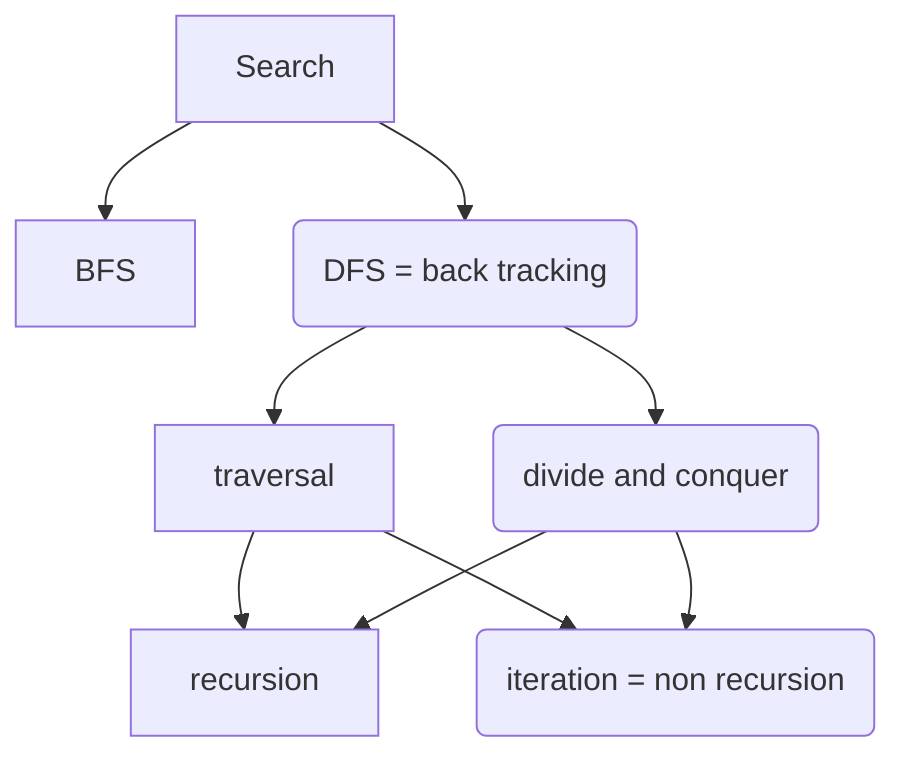

# divide and conquer
* quick sort 912.sort-an-array.cpp
- merge sort 912.sort-an-array.cpp
* quick select  215.kth-largest-element-in-an-array.cpp

## binary tree

# binary search
* leetcode/704.binary-search.cpp
- leetcode/658.find-k-closest-elements.cpp
- leetcode/852.peak-index-in-a-mountain-array.cpp
- leetcode/33.search-in-rotated-sorted-array.cpp
#  BFS && DFS & GRAPH
- leetcode/102.binary-tree-level-order-traversal.cpp
- leetcode/173.binary-search-tree-iterator.cpp
- leetcode/133.clone-graph.cpp

## back tracking
* leetcode/78.subsets.cpp
* leetcode/90.subsets-ii.cpp
## Topological sorting
* leetcode/207.course-schedule.cpp

* leetcode/114.flatten-binary-tree-to-linked-list.cpp
* leetcode/230.kth-smallest-element-in-a-bst.cpp

