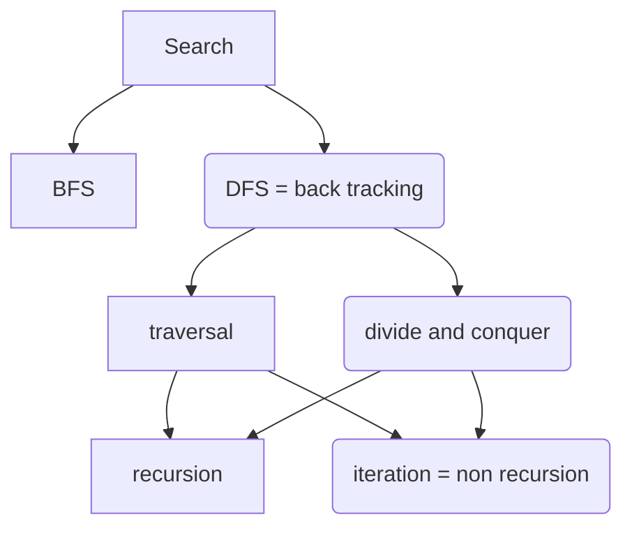

# divide and conquer
* quick sort 912.sort-an-array.cpp
* merge sort 912.sort-an-array.cpp 12:11
- quick select  215.kth-largest-element-in-an-array.cpp 12:33

## binary tree

# binary search
- leetcode/704.binary-search.cpp 2:17
- leetcode/658.find-k-closest-elements.cpp  32:35
- leetcode/852.peak-index-in-a-mountain-array.cpp 15:06
- leetcode/33.search-in-rotated-sorted-array.cpp 47:54
#  BFS && DFS & GRAPH
- leetcode/102.binary-tree-level-order-traversal.cpp 15:56
- leetcode/173.binary-search-tree-iterator.cpp   5:57
- leetcode/133.clone-graph.cpp  9:51
- leetcode/17.letter-combinations-of-a-phone-number.cpp   6:02
- leetcode/114.flatten-binary-tree-to-linked-list.cpp 15:21
-  leetcode/230.kth-smallest-element-in-a-bst.cpp 3:28 
## Backtracking
- leetcode/78.subsets.cpp 7:02
* leetcode/90.subsets-ii.cpp 6:05
- leetcode/39.cpp 5:10
- leetcode/40.combination-sum-ii.cpp 4:07 （尝试不使用hash的方法
* leetcode/212   hard（可以试试
* leetcode/126    hard（目前还没提交过
## Topological sorting
* leetcode/207.course-schedule.cpp 27:33

* leetcode/567.permutation-in-string.cpp

## hash
- leetcode/146.lru-cache.cpp

## heap
- leetcode/264.ugly-number-ii.cpp
- leetcode/973.k-closest-points-to-origin.cpp

# double point
* leetcode/443.string-compression.cpp

## dynamic program
- leetcode/264.ugly-number-ii.cpp
- leetcode/120.triangle.cpp
- leetcode/1143.longest-common-subsequence.cpp

record : 21 -finished